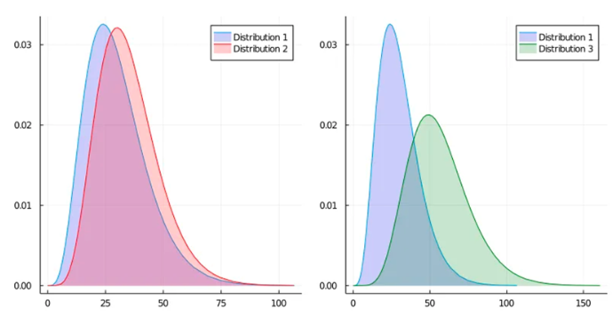

全手打，转载请备明出处

西瓜书

~~西瓜 ( 确信 )~~

---

目录

[Linear Regression](#LinearReg)

[Logicstic Regression](#LogicReg)

[Linear Discriminant Analysis ( LDA )](#LDA)

[Decision Tree](#DT)

[Neural Networks](#NN)

[Support Vector Machine ( SVM )](#SVM)

[Bayes Classifier](#BC)

[Clustering](#Clus)

[Ensemble Learning](#EL)

[Dimensionality Reduction](#DR)

---

# 线性回归 ( Linear Regression )

$$
\mathbf{Y} = \begin{bmatrix}
y_1 \\ y_2 \\ \vdots \\ y_m
\end{bmatrix};\;
\mathbf{X} = \begin{bmatrix}
x_1, 1  \\ x_2, 1  \\ \vdots  \\ x_m, 1
\end{bmatrix};\;
\mathbf{W} = \begin{bmatrix}
\mathbf{\omega} \\ b
\end{bmatrix}  \\
\hat{\mathbf{Y}} = \mathbf{X}\mathbf{W}
$$

对于平方误差（损失）

$$
\begin{aligned}
E(\mathbf{W}) &= \sum_i^m(y_i-x_i\omega_i-b)^2  \\
&= (\mathbf{Y} - \mathbf{X}\mathbf{W})^2  \\
&= (\mathbf{Y} - \mathbf{X}\mathbf{W})^T(\mathbf{Y} - \mathbf{X}\mathbf{W})  \\
&= \mathbf{Y}^T\mathbf{Y} - \mathbf{Y}^T\mathbf{X}\mathbf{W} - \mathbf{W}^T\mathbf{X}^T\mathbf{Y} + \mathbf{W}^T\mathbf{X}^T\mathbf{X}\mathbf{W}  \\
&= \mathbf{Y}^T\mathbf{Y} - 2\mathbf{Y}^T\mathbf{X}\mathbf{W} + \mathbf{W}^T\mathbf{X}^T\mathbf{X}\mathbf{W}
\end{aligned}
$$

要使 $E(\mathbf{W})$ 最小，则对 $\mathbf{W}$ 求偏导，并令其为 0

$$
\begin{aligned}
\nabla E(\mathbf{W}) = \frac{\partial E}{\partial \mathbf{W}} &= - 2\mathbf{Y}^T\mathbf{X} + 2\mathbf{X}^T\mathbf{X}\mathbf{W} = 0  \\
\mathbf{X}^T\mathbf{X}\mathbf{W} &= \mathbf{Y}^T\mathbf{X}  \\
\mathbf{W} &= (\mathbf{X}^T\mathbf{X})^{-1}\mathbf{Y}^T\mathbf{X}
\end{aligned}
$$

# Logicstic Regression

## 最大似然 ( Max Likelihood )

概率：已知参数估计实验结果  
似然：已知实验结果估计参数

$$
\begin{aligned}
L(\theta|x) &= p_{\theta}(x) = P_{\theta}(X=x)  \\
L(\theta|x_1,\dots,x_m) &= p_{\theta}(x_1)\cdot p_{\theta}(x_2),\dots,p_{\theta}(x_m)  \\
\ln (L(\theta|x)) &= \sum_i^m\ln (p_{\theta}(x_i))  \\
\end{aligned}
$$

因为 $\theta\rightarrow L$ ，所以要求最大似然的 $\theta$ ，则有

$$
\theta^* = argmax_\theta\ \ln L
$$

## 梯度下降 ( Gradient Desent )

> 并不是所有的矩阵微分都可以直接求得偏导为 0 的点，因此我们需要使用到 `梯度下降法`

$$
\begin{aligned}
Taylor:\ &f(x+\Delta x) = f(x) + f'(x)\Delta x + o(\Delta x)  \\
要使\ &f(x+\Delta x) < f(x)\ 恒成立  \\
即使\ &f'(x)\Delta x < 0 \Rightarrow \Delta x\nabla f(x) < 0  \\
只需使\ &\Delta x = -\eta\nabla f(x)  \\
\Rightarrow &-\eta{\nabla f(x)}^2 < 0\ 恒成立
&\end{aligned}
$$

## 对数几率回归 ( Logicstic Regression )

概率 : $\frac{发生}{全体}$

几率 : $\frac{发生}{不发生}$

我们希望通过将原始样本映射到一个新的样本空间中，通过计算新的样本空间中样本属于不同类别的几率实现分类

$$
\begin{align}
\mathbf{Z} &= \mathbf{X}\mathbf{W} + b  \\
Sigmoid: \mathbf{Y} &= \frac{1}{1+e^{-\mathbf{Z}}}  \\
&\Rightarrow\mathbf{Z} = \ln \frac{1-\mathbf{Y}}{\mathbf{Y}}  \\
&\Rightarrow \ln \frac{p(y=1|x)}{p(y=0|x)} = \mathbf{X}\mathbf{W} + b  \\
p(y=0|x) = \frac{1}{1+e^\mathbf{Z}}&,\quad p(y=1|x)=\frac{e^\mathbf{Z}}{1+e^\mathbf{Z}}
\end{align}
$$

Sigmoid 是将新样本映射到 $(0,1)$ 区间上，根据阈值可以直接进行二分类

对于最大似然函数有：

$$
L(w, b) = \sum_i^m\ln p(y_i|x_i; w, b)
$$

对于 $p(y_i|x_i; w, b)$ 可以有两种形式来表示，一种是基于二项分布的乘法形式，一种是等价的加法形式

$$
\begin{aligned}
乘法:\ &p(y_i|x_i; w, b) = p(y_i=1|x_i; w, b)^{y_i}\cdot p(y_i=0|x_i; w, b)^{1-y_i}  \\
加法:\ &p(y_i|x_i; w, b) = y_ip(y_i=1|x_i; w, b) + (1-y_i)p(y_i=0|x_i; w, b)
\end{aligned}
$$

这两种形式等价，因为是二分类问题，当 $y=1$ 时最大似然函数由 $p(y_i=1|x_i; w, b)$ 决定，另一项为 0 ；反之亦然。

（可以说加法形式是根据要求凑出来的，是为了将两个 p 合并成一个式子而来）~~我瞎说的~~

在这里我们选择乘法形式并将公式 (5) 代入算出：

$$
L(w,b) = \sum_i^m[\ln (e^{z_i}+1)-z_iy_i]
$$

（对于二分类问题，使用加法形式推导可以直接分类讨论，当 $y_i=0\ or\ y_i=1$ ）

我们要最大化似然函数 ( 希望训练时能分对 ) ，那么等价于最小化它的相反数，这样可以使用梯度下降法

$$
min_{w\ b}\ \sum_i^m[z_iy_i - \ln (e^{z_i}+1)]
$$

# Linear Discriminant Analysis ( LDA )

> 上面的对数几率回归是先用线性回归 $\mathbf{Z} = \mathbf{X}\mathbf{W}$ 然后再使用对数几率进行分类，属于是中间存在过度子问题，即 A -> B -> C ，而我们想要一种方法是直接 A -> C

样本空间投影 -> 同类近，异类远

什么是近和远？我们通过所有点的重心和各个点的距离来衡量`近`，通过类与类重心之间的距离来刻画`远`。

假设是二维的情况，我们还是二分类，现在需要将原始的两类样本都投影到某一条直线 $\omega$ 上，记投影点到原点的距离为 $z$ ，有

$$
\begin{aligned}
z &= \Vert x\Vert_2\cdot cos<\omega, x>  \\
&= \Vert x\Vert_2 \frac{<\omega, x>}{\Vert \omega\Vert_2\cdot\Vert x\Vert_2}  \\
&= \frac{<\omega, x>}{\Vert \omega\Vert_2}
\end{aligned}
$$

我们只关心直线 $\omega$ 的方向，所以这里先默认 $\omega$ 是单位向量，因此上式分母为值 0

$$
z = <\omega, x> = \omega^Tx
$$

两类的重心（或者说均值）便是

$$
\mu = \frac{1}{n}\sum_{x\in X}x  \\
投影: \omega^T\mu
$$

（ n 是这类点的数量）

那么对于“同类近”有

$$
0: \sum_{x\in X_0}\Vert\omega^Tx - \omega^T\mu_0\Vert_2^2  \\
1: \sum_{x\in X_1}\Vert\omega^Tx - \omega^T\mu_1\Vert_2^2  \\
$$

$z$ 是到原点的距离，用 $\Vert\Vert_2$ 已经可以刻画距离，但是为了方便计算，这里还是平方了一下。

同样，对于“异类远”有 ( 中心点距离远 )

$$
\Vert\omega^T\mu_0 - \omega^T\mu_1\Vert_2^2
$$

我们可以对上式化简，以类 0 为例：

$$
\begin{aligned}
\sum_{x\in X_0}\Vert\omega^Tx - \omega^T\mu_0\Vert_2^2 &= \sum_{x\in X_0}[\omega^T(x-\mu_0)]^2  \\
&= \sum_{x\in X_0}[(x-\mu_0)^T\omega]^2  \\
&= \sum_{x\in X_0}\omega^T(x-\mu_0)(x-\mu_0)^T\omega 
\end{aligned}  \\
(x-\mu_0)(x-\mu_0)^T \triangleq \Sigma_0
$$

同理可得

$$
1: \sum_{x\in X_1}\omega^T(x-\mu_1)(x-\mu_1)^T\omega  \\
(x-\mu_1)(x-\mu_1)^T \triangleq \Sigma_1
$$

类间距离为

$$
\omega^T(\mu_0-\mu_1)(\mu_0-\mu_1)^T\omega
$$

其中 $x\ \mu_0\ \mu_1$ 为已知量，为了方便起见，记

$$
S_b = (\mu_0-\mu_1)(\mu_0-\mu_1)^T  \\
S_w = \Sigma_0 + \Sigma_1
$$

$S_b$ : `类间散度矩阵 ( betweein-class scatter matrix )`  
$S_w$ : `类内散度矩阵 ( within-class scatter matrix )`

我们想要最大化 $S_b$ 最小化 $S_w$ ，因此可以将其合并成一个式子

$$
max_\omega\ J(\omega) = \frac{\omega^TS_b\omega}{\omega^TS_w\omega}  \tag{1}
$$

上式称为 `广义瑞利商 ( generalized Rayleigh quotient )` ，我们的目标是最大化广义瑞利商

我们只关心 $\omega$ 的方向（前面也假设过 $\omega$ 是单位向量），因此这里的 $\omega$ 的成倍缩放不影响目标函数的值（也因为这里式子的形式，成倍缩放分子分母直接抵消，比值不变）

因此我们可以直接令 $\omega^TS_w\omega = 1$ ，则 (1) 式等价于

$$
min_\omega\ -\omega^TS_b\omega
$$

建立了约束条件（特别是这种有等式的约束条件），我们即可用 `拉格朗日乘子法`

$$
\begin{aligned}
L(\omega,\lambda) &= -\omega^TS_b\omega + \lambda(\omega^TS_w\omega - 1)  \\
\nabla_\omega L(\omega,\lambda) &= -2S_b\omega + 2\lambda S_w\omega = 0  \\
\Rightarrow S_b\omega &= \lambda S_w\omega  \tag{2}
\end{aligned}
$$

我们看到 (2) 式形式比较像特征值 & 特征向量问题，因此我们像将其凑出来

$$
S_w^{-1}S_b\omega = \lambda\omega
$$

原问题等价于求上式的特征值，那么就会有以下问题：

1. 如果有多个特征值，如何选择？

    假设解有 $(\lambda_1,\omega_1),\ (\lambda_2,\omega_2)$ ，对于 $(\lambda_1,\omega_1)$ 则有

    $$
    \begin{aligned}
    S_b\omega_1 &= \lambda_1S_w\omega_1  \\
    \Rightarrow -\omega_1^TS_b\omega_1 &= -\omega_1^T\lambda_1S_w\omega_1  \\
    &= -\lambda_1
    \end{aligned}
    $$

    同理对于 $(\lambda_2,\omega_2)$ 有 $-\omega_2^TS_b\omega_2 = -\lambda_2$

    因此当有多个特征值时，我们选择最大的那个（最小化 $-\lambda$ ）

2. 如何求解特征值？

    令行列式 $|S_w^{-1}S_b-\lambda I| = 0$

3. 如果 $S_w$ 不可逆

    正则化。

    数学上可以严格证明 $\forall$ 对称阵 $A$ ，都有 $A+\lambda I$ 一定可逆。因此可以

    $$
    最小化\quad -\omega^TS_b\omega + \gamma\Vert \omega\Vert_2^2
    $$

4. 得到 $\omega$ 后，如何分类？

    降维后（投影），直接用任意其他分类器（如最近邻分类器）

# 决策树

## 信息 & 信息熵

信息是用来消除随机不确定性的东西

量化信息 - 信息量，需要满足：
1. 非负
2. 可加 $I(xy) = I(x) + I(y)$
3. 事件发生的概率 $p(x)$ 越大，信息量 $I(x)$ 越小

因此可以用负对数形式表示：

$$
I(x) = -log_2p(x)\qquad p(x)=0\ 时\ I(x)=0
$$

如果一个消息有很多种结果，那么我们可以通过计算其平均信息量来表示它的信息量。

`信息熵 ( 香农熵，平均信息量 )`

$$
\begin{aligned}
Ent(x) &= \sum_{i=1}^nI(x_i)p(x_i)  \\
&= -\sum_{i=1}^np(x_i)log_2p(x_i)
\end{aligned}
$$

比如说 26 个字母，假设每个字母出现次数均匀，那么英文的信息熵就是

$$
\begin{aligned}
Ent(x) &= -\sum_{1}^{26}\frac{1}{26}log_2\frac{1}{26}  \\
&= -log_2\frac{1}{26} = 4.7
\end{aligned}
$$

( 实际上因为字母出现的频率不同，真实结果是 4.03 )

我们根据 Ent 的定义式子可以看出， Ent 越小的时候，信息的纯度越高，最小为 0 ( 由概率为 0 和概率为 1 的一些事件组成 ) ，最大为 $log_2|n|$ ( 当每个事件发生的概率相同时 ) 。

## 决策树-算法原理

**信息增益**

所谓决策树，就相当于我们日常在判断一个事物好坏时自然而然用到的方法：从各个角度（属性）去判断事物的好坏。

比如在挑选西瓜时，会先拍一拍听听声音，如果有种紧绷的感觉，则可能是好瓜；然后再去看看根蒂、条纹等等。这个过程就像一个树形结构一般，分出不同的分支决策。

但是此时就会出现问题：
1. 如何判断好坏？ - 该类别中哪个多就是哪个（比如声音清脆的样本中好瓜多，则清脆好）
2. 以什么顺序去判断？（先拍一拍再看条纹，还是反过来）

根据直觉，我们肯定希望最先使用的属性 尽可能使得区分效果更好，如果一次性就将好瓜坏瓜全部分开那就最好不过了。

所以我们需要一个量来比较 划分前 和 划分后 两个状态，使得划分后单一类型的瓜纯度更高的属性，我们在决策时就最先去判断。而有了上面定义过的信息量和信息熵就能很好的解决这个问题。

首先将判断西瓜的好坏问题抽象出来。

现在有离散的属性 $a$ ，表示判断的依据（比如： $a$ 是以声音为依据），共有 $V$ 个可能取值 （清脆、浑浊等）

$$
a = \{a^1, a^2,\dots, a^V\}
$$

$D$ 是所有的西瓜（我们事先知道这些西瓜的好与坏，试图通过这些样本找到一个判断标准）

现在定义 $D^v$ 为 $D$ 在 $a^v$ 上的取值，即

$$
D^v = \forall d\in D,\ d\ 满足\ a^v
$$

( 简单来说就是，声音清脆的瓜都在 $D^{声音清脆}$ 里面 )

我们可以计算出划分好坏前的信息熵 ( 划分前的瓜中只有好与坏两种取值 )

$$
Ent(D) = -\sum_{i=1}^2p_ilog_2p_i  \\
( Ent(D) = -\sum_{k=1}^{|Y|}p_klog_2p_k )
$$

$p_i$ 就是瓜是好是坏的概率，第二个式子是一般形式 ( 假定当前样本集合中第 k 类样本所占比例为 $p_k$ ，一共有 $|Y|$ 类，本例中有好坏两类 ) ，最终得到的可以表示划分前的纯度

现在我们用离散属性 $a$ 划分后，每个可能的取值都会有一个集合 $D^v$ ，我们要求每一个可能取值的信息熵，这样就可以得到根据该取值分类后的纯度

$$
Ent(D^v) = -\sum_{i=1}^2p_ilog_2p_i
$$

同样，该取值中只有好瓜坏瓜两种。但是不同的取值集合中样本的数量不同，显然样本数越多的分支节点（取值）对于划分结果的影响越大，所以我们需要给每个分支一个权重 $\frac{|D^v|}{|D|}$ ( $|D^v|$ 表示该集合的样本数量 ) ，然后将所有分支加权求和，即可得到划分后的信息熵

$$
Ent(a) = \sum_{v=1}^V\frac{|D^v|}{|D|}Ent(D^v)
$$

我们将划分前的信息熵 - 划分后的信息熵，得到的差值就可以得到 `信息增益 ( information gain )`

$$
Gain(D,a) = Ent(D) - \sum_{v=1}^V\frac{|D^v|}{|D|}Ent(D^v)
$$

信息熵越小，纯度越大。因此一般而言，信息增益越大 ( 划分后纯度高 -> 被减数小 ) 意味着使用属性 $a$ 划分所得的 “纯度提升” 越大，即可以用来作为划分属性选择的标准。

$$
a^* = argmax_{a\in A}\ Gain(D,a)
$$

( 找到使得 $Gain(D,a)$ 值最大的参数 $a$ )

但是，单纯的信息增益有一个缺陷：对可取值数目 $V$ 较多的属性有所偏好。（比如我们通过编号作为属性去判断，那么有几个瓜就有几个可能取值，并且每个取值的集合的样本数为 1 ，导致了 $Ent(a) = 0$ ）

为了减少这种偏好带来的不利影响，我们可以使用 `增益率 ( gain ratio )`

$$
Gain\_ratio(D,a) = \frac{Gain(D,a)}{IV(a)}  \\
IV(a) = -\sum_{v=1}^{V}\frac{|D^v|}{|D|}log_2\frac{|D^v|}{|D|}
$$

$IV(a)$ 称为 属性 $a$ 的 `固有值 ( intrinsic value )` ，一般来说属性 $a$ 的取值数目 $V$ 越大， $IV(a)$ 越大。所以增益率与信息增益相反，对于 $V$ 较小的 $a$ 偏好。因此我们通常先通过信息增益高的属性，再从中挑选出增益率高的。

**基尼指数**

~~( 本来挺喜欢决策树的 )~~

除了使用信息增益和增益率之外，还有一种选择划分方法 `基尼指数 ( Gini index )` 

对于 $D$ 的纯度可以通过基尼值来度量

$$
\begin{aligned}
Gini(D) &= \sum_{k=1}^{|Y|}\sum_{k'\neq k}p_kp_{k'}  \\
&= \sum_{k=1}^{|Y|}p_k\sum_{k'\neq k}p_{k'}  \\
&= \sum_{k=1}^{|Y|}p_k(1 - p_k)  \\
&= 1 - \sum_{k=1}^{|Y|}p_k^2
\end{aligned}
$$

直观来看，基尼值表示，随机抽取两个样本，它们分类不同的概率。因此基尼值越小，样本越纯

同样的，我们可以根据划分后加权基尼值和 ( 即基尼指数 ) 表示划分后的纯度

$$
Gini\_index(D,a) = \sum_{v=1}^V\frac{|D^v|}{|D|}Gini(D^v)
$$

我们希望基尼指数越小越好，即

$$
a^* = argmin_{a\in A}\ Gini\_index(D,a)
$$

**剪枝处理**

在训练时，我们为了尽可能正确分类训练样本，可能会使分支过多，容易造成过拟合现象。因此我们需要主动去掉一些分支来降低过拟合的风险

基本策略：
1. `预剪枝 ( pre-pruning )` : 提前终止某些分支的生长
2. `后剪枝 ( post-pruning )` : 生成一颗完全决策树后，再回头自下而上剪枝

值得一提的是，不管是预剪枝还是后剪枝，我们都需要对决策树进行泛化能力评估，因此都需要预留一部分数据作为验证集。我们这里假设采用 `留出法` （直接预留一部分作为验证集）

同样可以采用 `( k 折 ) 交叉验证法 ( K-fold Cross-Validation )` （将数据集分成 k 份，每次训练时取一份留作验证，其余用作训练，一共训练 k 次）

- 预剪枝

    在使用某一属性 $a$ 划分后，本来应该对其每个节点使用下一个属性进行再次划分

    但是我们在预剪枝时会通过验证集计算一下 使用 $a$ 划分之前的精度，然后在计算一下划分后的精度。如果精度下降了，那么这个分支节点将禁止接着划分（使用该属性划分后更烂了）；如果精度提高了，那么对于该属性的每一个分支节点使用下一个属性进行递归划分。

    这样的好处是划分次数少，效率提高了；但是缺点却是有可能某些被剪枝的节点在后续的（更长远的）划分中表现会更好，却直接被扼杀在萌芽阶段。

- 后剪枝

    对于后剪枝，我们此时已经完全生成了决策树，然后自下而上判断，在验证集上划分前精度更高，则剪掉该划分节点。

    优点是无遗漏；缺点是需要生产整棵树，效率比预剪枝低。

**递归出口**

有 3 种情况可以不再继续划分：
1. 划分之前，只有 1 类（全是好瓜）
2. 没有属性可以提供 或 属性没有意义（所有样本在每一个属性中表现相同）
3. 划分时，当前节点 $D^v$ 为空时

# 神经网络

模式分类问题的目标 为 将待识别测试样本划分到准确的类别中

对应到几何上面，就是有 2 类点 ( 假设是二分类 ) ，需要找到一条直线 或 超平面将它们尽可能分隔开。也许并不是直线，但是我们可以通过特征提取将其映射到新的样本空间中，使之可以用直线分割 ( 比如 LDA ) 。

对于逻辑几率回归来说，我们也是通过分类的几率来学习一个权重 $w$ ，使得我们可以找到比较好的样本空间 $z=xw$ ，使得分类更加准确，也是特征提取（将原始样本映射到新的样本空间，使得可以更好的进行任务）。

对于前面的 LDA ，主要算法也是集中在如何进行特征提取（分割）上，对于提取之后如何找到超平面反而是直接使用的其他方法。

但是，特征提取是需要专家的。比如说两类的离散点形成了一个圆，一类是内圈，一类是外围圆环。我们很容易想到使用极坐标的方式，可以将其分成可以用一条直线分开的两类。这就是专家知识。

很多时候，我们没有专家知识，因此需要某种方法可以尽可能避免特征提取。（这句话是我瞎说的，特征提取还是很有用的）

## 感知器 ( perceptron )

感知机是模拟人脑和神经元的结构提出的模型。

树突（采集信号，即输入） -> 体细胞（收集整理信号，即加权求和） -> 轴突（激活-传递神经冲动，即激活函数）

假设是二分类问题，对于一个样本 $x_i$ 有 d 个特征 $x_{ij}$ ，即全体样本 $X_{n\times d}$

感知机的大致思想是，判断一个样本的类型，输入 $x_{i\cdot}$ ，对于每一个特征有对应的权重值，即 d 个权重 $w_{1\times d}$ ，加权求和后得到 $w^Tx_i$ ，经过激活函数 $sign(x)=\frac{x}{|x|}$ (sign(0)=1) 后会将 $w^Tx_i$ 映射到 -1 或者 1 ，即分成了两类。

因此我们需要在训练时学习特征的权重 $w$ 。训练时每次输入一个样本用现有的 $w$ 分类，如果分错了，则使用当前样本进行权重更新。

1. 输入，计算分类结果

$$
\hat{y_i} = sign(w^Tx_i)
$$

2. 更新权重向量 $w$

$$
\begin{cases}
不更新\ w &, 如果 y_i=\hat{y_i}  \\
w = w+\eta y_ix_i &, 如果 y_i\neq \hat{y_i}
\end{cases}
$$

有的文献更新时使用的是 $w=w+\eta(y_i-\hat{y_i})x_i$ ，对于二分类其实是等价的，因为分类正确更新值为 0 ，不正确时仅仅是系数改变，可以通过 $\eta$ 调整。

最终得到训练好的 $w$ 可以尽可能多的将两类点分开。

对于 $y_ix_i$ ，可以通过分类讨论和几何方法证明

**分类讨论**

1. case 1: $y_i=1,\ \hat{y_i}=-1$

    更新前: $\hat{y_i} = sign(x_iw) = -1\ \Rightarrow\ x_iw < 0$

    更新后: 

    $$
    \begin{aligned}
        \hat{y_i}^{new} &= sign((w+\eta y_ix_i)^Tx_i)  \\
                      &= sign(w^Tx_i+\eta y_ix_i^Tx_i)  \\
                      &= sign(w^Tx_i+\eta \Vert x_i\Vert_2^2)
    \end{aligned}  \\
    选择何时的\ \eta\ 可以使得\ w^Tx_i+\eta \Vert x_i\Vert_2^2 > 0  \\
    则可以使 \hat{y_i}^{new} = 1 = y_i
    $$

2. case 2: $y_i=-1,\ \hat{y_i}=1$

    同理可以调整 $\eta$ 使得 $w^Tx_i-\eta\Vert x_i\Vert_2^2 < 0$ ，则可以使 $\hat{y_i}^{new} = -1 = y_i$

**几何直觉**

对于 case 1 & 2 来说，都是会 $-\eta x_i$ ，对于向量来说，两个向量相减（超平面法向量和 $x_i$ ）就是后一个的末尾指向前一个的末尾 ( $x_i$ 指向 $w$ ) ，我们可以严格证明是将分错的点重新分到了对的一边去（从几何上也可以直观看出）

**多分类**

多分类问题可以看作二分类，有两种视角：
1. 一对一 (OvO): 两两分类投票，一共分 $\frac{C(C-1)}{2}$ 次 ，最终归于票数多的那一类
2. 一对多 (OvR): 每次二分类是 A 和 非 A ，一共分 $C$ 次 （若非 A 则判断是 B 非 B ，以此类推）

**对于感知机来说，只能处理线性可分的样本（也就是直线、平面、超平面）**，因此感知机算法出现时曾引发轰动，但是也是昙花一现。

## 深度神经网络

上面单层感知机 ( Single-layer perceptron ) 是单个神经元，而我们还有浅层神经网络 ( Shallow Neural Networks ) 和深层神经网络 ( Deep Neural Networks ) ，浅层和深层的区别仅仅是中间隐藏层层数的区别。

浅层神经网络中间隐藏层仅 1 层，而深层可以 very deep

如上图，输入层与感知机的输入一样，会输入所有的样本特征，然后对于隐藏层中每一个圆都是一个感知机，最终在最后一层隐藏层和输出层之间通过某种方法 ( 比如 softmax 等 ) 进行分类与回归。

之前的感知机是通过加权求和 ( 矩阵相乘 ) - 激活函数进行分类的，本质上是线性的，因此也只能处理线性可分样本。

而多个感知机叠起来，每一个感知机通过线性的矩阵相乘再通过激活函数，正是感知机的存在，将感知机的输出作为输入传入下一个感知机后，就不再是线性的了 ( 单纯由矩阵相乘得到 ) 。因此可以处理非线性可分问题。

而神经网络中的权重参数 ( 如上述，权重会有很多 ) 同样是用梯度下降法来更新训练

**梯度下降**

对于损失函数有

$$
E(w) = \frac{1}{n}\sum_{i=1}^ne_i(w) = \frac{1}{n}\sum_{i=1}{n}L(y_i, f(w;x_i))
$$

常见的梯度下降有三种方法：

1. 批量梯度下降 ( Batch Gradient Descent )

    批量梯度下降就是对于所有的 $e_i$ 都计算一个梯度，然后取平均值，进行权重更新

    $$
    w_{t+1} = w_t - \eta \nabla E(w_t)  \\
    w_{t+1} = w_t - \eta\frac{1}{n}\sum_{i=1}^n\nabla e_i(w_t)  \\
    $$

2. 随机梯度下降 ( Stochastic Gradient Descent )

    批量梯度下降虽然可以一步一步直接靠近极值点，但是考虑到硬件限制，我们可能有一个极其大的训练集，没办法一次性计算出所有 $e_i$ 的梯度再取平均。因此我们需要找到一个方法，既可以找到极值点，又可以节省资源空间。

    随机梯度下降是在每次更新时，只计算一个 $e_i$ 的梯度进行更新（随机选择一个），这样保证了每次会离极值点近一些，虽然时间上效率降低了，但是确实在接近

    $$
    w_{t+1} = w_t - \eta\nabla e_i(w_t)
    $$

    事实上，因为我们输入样本时会故意将样本顺序打乱，避免有时爬下来的数据中本身同类的样本在一起，我们抽取的一个样本梯度本身就是随机的（本来这里的随机的作用也是这个）

3. 小批量梯度下降 ( Mini-batch Gradient Descent )

    随机梯度下降效率低，而批量梯度下降又因为硬件限制无法使用。因此需要一个更好的方法。

    小批量梯度下降是将训练集分成若干堆，每次拿一堆进行训练和梯度更新（这一堆使用的是批量梯度下降）

    $$
    w_{t+1} = w_t - \eta\frac{1}{|B_k|}\sum_{i\in B_k}\nabla e_i(w_t)  \\
    $$

epoch : 使用 Mini-batch 时每个 batch 被使用的次数 ( 可以直接理解为训练的轮数 )

**特征工程和特征学习**

我们回到之前在神经网络开头提到过的特征提取问题，我们发现感知机不需要特征提取，而基于感知机的神经网络也不需要，它们是通过 `特征学习` 来训练模型的，我们将需要特征提取的称为 `特征工程` 。

特征工程：  
好处：独立于数据，不需要有大量好的训练样本。 ( 因为可以通过专家知识提取出好的 features )  
坏处：一旦数据多了，不能学习数据内在的特征，因此上限比较低

特征学习：  
好处：上限高，可以直接学习到数据内在的特征，属于端到端学习 ( End-to-End Learning ) ( 即输入后经过模型直接得到输出 )  
坏处：参数多 ( 多数使用 Deep NN ) ，依赖好的训练样本

## 卷积神经网络 ( Convolutional Neural Networks, CNN )

卷积就是原始图像通过卷积核变成一个新图像，懒得写了，随便写一些吧

操作基本顺序：卷积 ( 步长 - 填充 ) - 激活- 池化

**卷积 ( Convolution )**

比如卷积核为 3x3 ，那么我们会在原始图像上从左上角开始的 3x3 区域，每个像素 乘上 卷积核中对应位置的值，最终将它们加起来形成一个像素，即原始图像的 3x3 区域变成新图像中的 1 个像素 ( 同样是左上角那个位置 )

**池化 ( Pooling )**

比如 2x2 的平均池化，就是从左上角开始的 2x2 区域求均值变成新图像中的 1 个像素点，同理还有最大池化等

**步长 ( Stride )**

普通的卷积操作时从左上角开始，每次操作后向右平移一列继续下一个区域 ( 3x3 ) 到最右边后向下移一行，从最左边同样操作

而步长则是控制一次移动几行或几列，多用于原图像比较大时，希望卷积层少一些 ( 使复杂度不那么高 )

**填充 ( Padding )**

普通卷积操作每次操作完后会缩小图像维度，当我们希望卷积层比较多，或者输出不改变原图像尺寸时，可以在左右上下同时添加等量行列，扩大原图像尺寸。

填充方式有：全 0/1 ，镜像 ( 原始图像边缘像素翻转 ) 等

**通道 ( Channel )**

通道可以理解为从多少角度去观察图像，比如人脸识别，可能不同通道学出来的区域不同，有的通道是眼睛，有的是耳朵

**经过一层卷积层后，不管输入通道有多少，输出通道数只与卷积核的个数有关** ( 卷积核的通道数与输入通道数相同，最和不同通道加起来得到一个输出通道。每个卷积核实现上述操作一次 )

## LeNet

## AlexNet

只和 kernel_size 有关 ( 32x32x10 )

top 5 test error : 分类时，排在前面 5 个中出现了正确的类别，那么就认为分类正确

dropout 不先删边，一般认为训练过程中不知道模型适当的复杂度，但是我们可以通过在训练途中，如果过拟合则丢弃一些边，使得模型复杂度下降，缓解过拟合

## GoogLeNet

Inception 模块，使用不同的卷积核，拼起来

没有全连接层 -> 参数少

## ResNet

学习残差，使得神经网络可以无限深

BP ( back-propagation ) 算法只是优化算梯度的过程，并没有优化神经网络算法

# 支持向量机 ( Support Vector Machine, SVM )

通过 SVM 分类，即是假设当前样本的不同类别可以在高维空间中被一个超平面完全分开，分开后降维得到的超平面“痕迹”即是分类器，并且我们想要不同类别距离分类器有最大间隔，使得如果新的点的位置不那么好，也可以正确分开

对于上图， '+', '-' 分别为两类，我们需要寻找一个超平面（这里就是直线，对于更一般情况来说就是超平面），使得可以完全分割两类点，并且我们希望两类点中离直线最近的那个点 离直线的距离尽量远，这样使得分类泛化性更好（即希望选择中间那条红线）

那么如何找到红线呢？

我们假设超平面方程为 ( 为了简便起见，这里的向量 $\omega\ x$ 就不加粗体了，并且后面称超平面为直线 )

$$
\omega^Tx + b = 0
$$

我们可以计算出平面上任意点 $x$ 到直线距离 ( $\omega$ 为法向量 )

$$
\begin{aligned}
    r &= \frac{<\omega, x>}{\Vert\omega\Vert_2\Vert x\Vert_2}\cdot \Vert x\Vert_2  \\
      &= \frac{|\omega x + b|}{\Vert\omega\Vert}
\end{aligned}
$$

我们要使得离直线最近的两类点离直线的距离都尽可能大，因此直线会介于它们正中间，那么我们过两类点可以得到与直线平行的两条直线

$$
\omega^Tx + b = c  \\
\omega^Tx + b = -c
$$

因为对称，所以等号右侧的互为相反数。

同样的，如果我们对于直线法向量 $\omega$ 放大或缩小并不会改变方向，因此对于方程 $\times\frac{1}{c}$ 总有右侧为 1 的式子，因此有

$$
\begin{cases}
    \omega^Tx + b \geq +1\ &,\ y_i = +1  \\
    \omega^Tx + b \leq -1\ &,\ y_i = -1  \\
\end{cases}  \tag{1}
$$

即最近的两类点带入直线方程分别为 1 -1 ，它们被称为 `支持向量 ( support vector )` ( 名称具体解释在后面 )

两类支持向量到直线的距离为

$$
\gamma = \frac{2}{\Vert\omega\Vert}
$$

我们要使得距离 $\gamma$ 最大，而 $\omega$ 在分母上不好求导，因此我们最小化它的倒数，并且直接对二范数平方（不影响却好算）

$$
min_{\omega\in R^d}\frac{\Vert\omega\Vert_2^2}{2}
$$

(1) 式是两类点的方程特点，我们将其合并可以得到最小化间隔时需要满足约束

$$
min_{\omega\in R^d}\frac{\Vert\omega\Vert_2^2}{2}\quad
s.t.\;\ y_i(\omega^Tx_i + b) \geq 1,\ i=1,\dots, m
$$

注意：这里只有 $\omega\ x_i$ 是向量， $y_i$ 是数

此时我们已经可以直接进行优化求解了 ( 对于这个式子没使用核函数升维时就有 d+1 维度，复杂度很高 ) ，对于这种我们一般回去求其 `对偶问题 ( dual problem )`

我们之前遇到过等式的约束条件 ( LDA 中 ) ，当时使用的是拉格朗日乘子法。而此时是不等式，我们将使用 `KKT 条件 ( Karush-Kuhn-Tucker conditions )`

**拉格朗日对偶问题**

假设原始问题为

$$
min\ f(x)\quad s.t.\; g(x) = 0
$$

则有，拉格朗日函数

$$
L(x,\lambda) = f(x) + \lambda g(x)
$$

现在引入拉格朗日对偶函数（后简称为对偶函数）

$$
h(\lambda) = inf_x L(x, \lambda)
$$

其中 $inf_x$ 表示 $L$ 关于 $x$ 取下确界

对于对偶函数可以证明两条性质：
1. 对偶函数一定是凹函数 ( 下凸 ) ，并且凹性与原目标函数 $f$ 和约束函数 $g$ 无关 [数学证明]()
2. 对于 $\forall\lambda\geq 0$ ， $\forall v$  ( 泛指向量中的每个分量 ) ，如果原问题最优解对应的目标函数值为 $p^*$ ( 即 $f(x^*)=p^*$ ) ，则 $h(\lambda)\leq p^*$ [数学证明]()

根据性质 2 ，对偶函数是原问题最优解的一个下确界，那么我们会去关注对偶函数的最大值，即最大化对偶函数，因此原问题的对偶问题为

$$
max_\lambda\ h(\lambda)\quad s.t.\;\ \lambda\geq 0
$$

上式的最优解 $\lambda^*$ 对应的函数值为 $d^*$ ，则一定有 $d^*\leq p^*$ ，我们将 $d^*-p^*$ 这段称为 `对偶间隙 ( duality gap )`

**KKT 条件**

KKT 条件是拉格朗日乘子法的推广 ( 一般来说还需要对偶间隙为 0 ，即 $d^*=p^* \Rightarrow h(\lambda^*) = f(x^*)$ ，且 $L$ 对 $x$ 可微 )

对于问题

$$
min_{x\in R^d}f(x),\quad s.t.\;\ g(x)\leq 0
$$

我们有拉格朗日函数

$$
L(x, \alpha) = f(x) + \alpha g(x),\ \alpha\geq 0
$$

我们假设 $x^*$ 为满足约束条件的最优解，对于所有 $x$ 都有

$$
x\in K=\{x\in R^d| g(x)\leq 0\}
$$

其中 $K$ 被称为定义可行域，那么 $x^*$ 要么落在可行域内，要么落在可行域上

$$
\begin{cases}
    g(x^*) < 0,\ K\ 内部,\ 内部解  \\
    g(x^*) = 0,\ K\ 边界,\ 边界解
\end{cases}
$$

1. 当 $x^*$ 为内部解时，我们发现 $g(x)$ 其实是没有用的 ( 可以考虑现在 $x^*$ 是我们求导找出来的解，这个解本身满足 $g(x^*) < 0$ ，不需要进行梯度更新，在正常计算过程中不会受到 $g(x)$ 的影响 ) ，因此约束条件无效，问题退化为无约束优化问题，此时 $\nabla f(x)=0$ 即可求出 $x^*$

2. 当 $x^*$ 为边界解时，此时就变成了 $min\ f(x)\quad s.t.\;\ g(x)=0$ ，即原始拉格朗日方法求解

总结以下，对于两种情况我们有

$$
L(x, \lambda) = f(x) + \lambda g(x)  \\
\begin{cases}
    1.\ \lambda = 0\ &内部解  \\
    2.\ \lambda > 0,\ g(x^*)=0\ &边界解
\end{cases}
$$

这里的 $\lambda$ 为什么 $>0$ 呢？我们希望 $min\ f(x)$ ，因此 $\nabla f$ 应该指向 $K$ 内部，而 $\nabla g$ 指向 $K$ 外部，而 $L(x,\lambda)$ 有

$$
\frac{\partial L}{\partial x} = \nabla f(x^*) + \lambda\nabla g(x^*) = 0
$$

因此 $\lambda > 0$ ，可以详见下图

我们将两种情况合并可以得到

$$
\begin{cases}
\nabla f(x^*) + \lambda\nabla g(x^*) = 0  \\
\lambda g(x^*) = 0  \\
g(x^8) \leq 0  \\
\lambda \geq 0
\end{cases}
$$

上面式子从上到下依次称为 平稳性、互补松弛性、原始可行性、对偶问题可行性

当有多个约束条件时有

$$
\begin{cases}
    \nabla f(x) + \sum_{i=1}^m\lambda_i\nabla g_i(x) = 0  \\
    g_i(x) \leq 0  \\
    \lambda \geq 0  \\
    \lambda_i g_i{x} = 0
\end{cases}
i=1,\dots,\ m
$$

对于 SVM 问题，我们的优化式子是

$$
min_{\omega\in R^d}\frac{\Vert\omega\Vert_2^2}{2}\quad
s.t.\;\ y_i(\omega^Tx_i + b) \geq 1,\ i=1,\dots, m
$$

对于 KKT 条件则有

$$
L(\omega, b, \lambda) = \frac{\Vert\omega\Vert_2^2}{2} + \sum_{i=1}^m\lambda_i[1-y_i(\omega^Tx_i+b)]  \\
\begin{cases}
    \frac{\partial L}{\partial w} = \frac{\partial L}{\partial b} = 0  \\
    1-y_i(\omega^Tx_i+b) \leq 0  \\
    \lambda_i \geq 0  \\
    \lambda_i[1-y_i(\omega^Tx_i+b)] = 0
\end{cases}
$$

第一条式子计算可以得到

$$
\begin{cases}
    \omega = \sum_{i=1}^m\lambda_iy_ix_i\qquad  &(1)  \\
    \sum_{i=1}^m\lambda_iy_i = 0\qquad &(2)
\end{cases}
$$

将其直接代入拉格朗日函数得到

$$
h(\lambda) = \sum_{i=1}^m\lambda_i - \frac{1}{2}\sum_{i=1}^{m}\sum_{j=1}^m(\lambda_i\lambda_jy_iy_jx_i^Tx_j)
$$

再将 (2) 式和其他约束作为约束条件得到

$$
s.t.\;\ \sum_{i=1}^m\lambda_iy_i = 0,\;\ \lambda_i \geq 0,\;\ i=1,\dots,m
$$

$h(\lambda)$ 是 $f(x)$ 的对偶问题，则 $min\ f(x)$ 即

$$
max_\lambda\; \sum_{i=1}^m\lambda_i - \frac{1}{2}\sum_{i=1}^{m}\sum_{j=1}^m(\lambda_i\lambda_jy_iy_jx_i^Tx_j)  \\
s.t.\;\ \sum_{i=1}^m\lambda_iy_i = 0,\;\ \lambda_i \geq 0,\;\ i=1,\dots,m
$$

此时，我们从$d+1$ 维度的优化问题变成了 $m$ 维度的优化问题。即对于对偶后的式子，参数的个数由样本的个数决定 $\lambda\in R^m$

样本个数远小于维数时，称为小样本问题。因此 SVM 对于小样本问题十分适用

现在我们可以用 Lagrange 直接求得对偶问题最优解 $\lambda^*$ ，将其代入 (1) 式和互补松弛性式子可得到

$$
\begin{cases}
    \omega^* = \sum_{i=1}^m\lambda^*y_ix_i  \\
    b^* = y_{i_0}- (\omega^*)^Tx_{i_0}  \\
    (\ 或者\ b = \frac{1}{S}\sum_{s\in S}(y_s-(\omega^*)^Tx_s)\ )
\end{cases}
$$

其中第一个 $b$ 式子中 $i_0$ 满足 某一个 $i_0\ s.t.\ \lambda_{i_0}^*\neq0$  
第二个 $b$ 式子中 $S = \{i|\lambda_i > 0, i=1,\dots,m\}$

我们发现，全过程中，我们用到了支持向量，对于其他不在那两条平行线上的点我们并没有用到。这也是支持向量这个名字的由来 ( 这几个点支持/支撑起来了向量 $\omega$ )

最终模型为

$$
f(x) = (\omega^*)^Tx + b = \sum_{i=1}^m\lambda_i^*y_ix_i^Tx + b^*  \\
$$

且有互补松弛条件

$$
\lambda^*[1-y_i(w^Tx+b^*)] = 0,\ i=1,\dots,m
$$

若 $\lambda^* = 0$ ，则最终模型与支持向量无关  
若 $\lambda^* \neq 0$ ，最终模型与支持向量相关， $1-y_i(w^Tx+b^*) = 0$

因为解的稀疏性，最终模型仅与支持向量相关

**核函数**

目前为止，我们解决了如何将线性可分样本分开的问题。那么如果原始样本无法被线性分隔呢？

如果原始空间是有限维，那么一定存在一个高维特征空间使得样本可分。 ( 这也很符合直觉，并且可以通过简单的思想实验去理解 )

现在我们通过非线性特征映射 $\phi$ 升维，得到新的样本空间 $\phi(x)$ ，将新的样本代入上面的方法中进行分隔，可以得到对偶问题

$$
max_\lambda\; \sum_{i=1}^m\lambda_i - \frac{1}{2}\sum_{i=1}^{m}\sum_{j=1}^m\lambda_i\lambda_jy_iy_j\phi(x_i)^T\phi(x_j)  \\
s.t.\;\ \sum_{i=1}^m\lambda_iy_i = 0,\;\ \lambda_i \geq 0,\;\ i=1,\dots,m
$$

样本以内积的形式出现，对于高维空间来说计算及其困难 ( 可能这个高维是无穷维 ) ，因此我们需要设计一个函数

$$
K(x_i, x_j) = \phi(x_i)\phi(x_j)
$$

即可以通过在原始样本空间计算得到高维空间中的内积，这个函数 $K$ 叫做 `核函数`

因此对偶问题变为

$$
max_\lambda\; \sum_{i=1}^m\lambda_i - \frac{1}{2}\sum_{i=1}^{m}\sum_{j=1}^m\lambda_i\lambda_jy_iy_jK(x_i,x_j)  \\
s.t.\;\ \sum_{i=1}^m\lambda_iy_i = 0,\;\ \lambda_i \geq 0,\;\ i=1,\dots,m
$$

最终模型为

$$
f(x) = \sum_{i=1}^m\lambda_i^*y_iK(x_i, x) + b^*  \\
$$

那么，是否一定存在合适的 $K$ ，又如何找呢？

`Mercer 定理` : 若一个对称函数 $K$ 所对应的 核矩阵半正定，则 $K$ 可以作为核函数使用

常用核函数 - `高斯核` : $K(x_i,x_j) = exp(-\frac{\Vert x_i-x_j\Vert_2^2}{2\sigma^2})$

核函数的选择是决定 SVM 性能的关键

**软间隔 ( soft margin )**

虽然我们理论上一定可以找到一个高维空间使得原始样本线性可分，但是现实中往往很难确定合适的核函数，即使找到了，我们也不知道其到底是合适还是过拟合

因此我们引入 `软间隔` ，允许在一些样本上不满足约束，而对应的前面所有样本满足约束则称为 `硬间隔 ( hard margin )`

原始约束：

$$
\begin{cases}
    \omega^Tx + b \geq +1\ &,\ y_i = +1  \\
    \omega^Tx + b \leq -1\ &,\ y_i = -1  \\
\end{cases}
\Rightarrow  y_i(\omega^Tx_i + b) \geq 1,\ i=1,\dots, m
$$

我们的思路是允许某些样本不满足约束，并且这样的样本尽可能少

$$
min\ \frac{1}{2}\Vert\omega\Vert_2^2 + C\sum_{i=1}^m l_{0/1}(y_i(\omega^Tx_i+b)-1)  \tag{3}
$$

其中 $C>0$ 是常数， $l_{0/1}$ 是 "0/1 损失函数"

$$
l_{0/1}(z) = 
\begin{cases}
    1,\ &if\ z<0  \\
    0,\ &otherwise
\end{cases}
$$

也就是说，当满足约束时，损失函数为 0 ，不对函数进行惩罚；当不满足约束时，损失函数为 1 ，对函数进行惩罚 ( 最小化 $\frac{1}{2}\Vert\omega\Vert_2^2$ 却在后面加上了一个 $>0$ 的数，导致无法到达最开始的最小值，即惩罚 )

当 $C\rightarrow\infty$ 时， (3) 式等价于原始优化式子

然而 $l_{0/1}$ 非凸、不连续，数学性质不好，因此我们使用其他函数代替 $l_{0/1}$ ，称为 `替代损失 ( surrogate loss )` ，下列三种常用替代损失函数

( 跳转标签：指数损失 )

$$
\begin{aligned}
    hinge\ 损失:\ &l_{hinge}(z) = max(0, 1-z)  \\
    指数损失\ (exponential\ loss):\ &l_{exp}(z) = exp(-z)  \\
    对率损失\ (logistic\ loss):\ &l_{log}(z) = log(1 + exp(-z))
\end{aligned}
$$

我们这里采用 hinge 损失，记

$$
\xi_i = max(0, 1-y_i(\omega^Tx_i+b))
$$

其中 $\xi_i$ 称为 `松弛变量 ( slack variables )` ， (3) 式可变化为

$$
min\ \frac{1}{2}\Vert\omega\Vert_2^2 + C\sum_{i=1}^m\xi_i  \\
s.t.\;\ y_i(\omega^Tx_i+b) \geq 1-\xi_i,\;\ \xi_i \geq 0,\;\ i=1,\dots,m
$$

( 后面的约束从 $\xi_i>max(\cdot,\cdot)$ 其中的两元得到 )

前面也说了 $C\rightarrow\infty$ 时为硬间隔，因此 $C$ 越大，越倾向于完全分隔；越小，泛化性越好

我们用前面的方法求解软间隔，有拉格朗日函数

$$
L(\omega, b, \xi, \lambda, \mu) = \frac{1}{2}\Vert\omega\Vert_2^2 + C\sum_{i=1}^m\xi_i + \sum_{i=1}^m\lambda_i(1 - \xi_i - y_i(\omega^Tx_i+b)) - \sum_{i=1}^m\mu_i\xi_i
$$

对其关于 $\omega\ b\ \xi_i$ 分别求偏导 $=0$ 得到

$$
\begin{cases}
    \omega = \sum_{i=1}^m\lambda_iy_ix_i\qquad  &(1)  \\
    \sum_{i=1}^m\lambda_iy_i = 0\qquad &(2)  \\
    C = \lambda_i + \mu_i\qquad &(3)
\end{cases}
$$

因此对偶问题为

$$
max_\lambda\; \sum_{i=1}^m\lambda_i - \frac{1}{2}\sum_{i=1}^{m}\sum_{j=1}^m(\lambda_i\lambda_jy_iy_jx_i^Tx_j)  \\
s.t.\;\ \sum_{i=1}^m\lambda_iy_i = 0,\;\ 0 \leq \lambda_i \leq C,\;\ i=1,\dots,m
$$

同样的，对于 $C\rightarrow\infty$ 则退化为硬间隔对偶问题

由 KKT 得最终模型仍然只与支持向量有关

我们再来看看优化式子，式子可以抽象为

$$
min_{f}\ \Omega(f) + C\sum_{i=1}^ml(f(x_i), y_i)
$$

其中 $\Omega(f)$ 称为 `结构风险 ( structural risk )` ，用于描述模型 $f$ 的某些性质，也被称为 `正则化项`  
其中 $\sum_{i=1}^ml(f(x_i), y_i)$ 称为 `经验风险 ( empirical risk )` ，用于描述模型与训练数据的契合程度  
其中 $C$ 用于对二者进行折中，表示惩罚的力度，被称为 `正则化常数` 。

上面的式子称为正则化问题，可理解为通过对不希望的结果施以惩罚，使得优化过程趋向于希望目标

从贝叶斯估计角度，可认为是提供了模型的先验概率

## SVM 回归 - SVR

SVR 用到与 SVM 同样的原理，它将样本升维使得可用线性模型拟合，因此用到与 SVM 同样的方法。

SVR 将 SVM 中的超平面当成回归预测的拟合，而 SVM 超平面中的最大间隔，则是当预测到间隔中时算作预测正确，即允许预测和实际之间的误差

对于回归问题，给定数据集 $D=\{(x_1,y_1),\dots,(x_m,y_m)\}$ ，希望得到一个回归模型 $f(x)=\omega^Tx+b$ 使得 $f(x)$ 与 $y$ 尽可能接近

在 SVR 中，我们允许 $\epsilon$ 的误差，即当 $|f(x)-y| \leq \epsilon$ 时才计算损失，对应到 SVM 中就是：对于最大间隔外的样本点进行惩罚。

优化函数

$$
min\ \frac{1}{2}\Vert\omega\Vert^2 + C\sum_{i=1}^ml_{\epsilon}(f(x_i)-y_i)
$$

同样的， $C$ 为正则化常熟， $l_{\epsilon}$ 为

$$
l_{\epsilon} = \begin{cases}
    0,\ &if\ |z| < \epsilon  \\
    |z| - \epsilon,\ &otherwise
\end{cases}
$$

因为我们希望在 $2\epsilon$ 隔离带外的样本尽可能少，即 $\omega^Tx+b$ 上下两侧 $\epsilon$ 距离，所以我们需要引入两个松弛变量

$$
\xi_i = max(0, f(x_i)-y_i-\epsilon)  \\
\hat{\xi_i} = max(0, y_i-f(x_i)-\epsilon)  \\
$$

则优化函数转换为

$$
min\ \frac{1}{2}\Vert\omega\Vert^2 + C\sum_{i=1}^m(\xi_i+\hat{\xi_i})  \\
s.t.\;\ f(x_i)-y_i \leq \epsilon + \xi_i,\;\ y_i-f(x_i) \leq \epsilon + \hat{\xi_i},\;\ \xi_i \geq 0,\;\ \hat{\xi_i} \geq 0  \\
i = 1, \dots, m
$$

上式经过 Lagrange 求偏导并代入得到对偶问题

$$
max\ \sum_{i=1}^my_i(\hat{\lambda_i}-\lambda_i) - \epsilon(\hat{\lambda_i}-\lambda_i) - \frac{1}{2}\sum_{i=1}^m\sum_{j=1}^m(\hat{\lambda_i}-\lambda_i)(\hat{\lambda_j}-\lambda_j)x_i^Tx_j  \\
s.t.\;\ \sum_{i=1}^m(\hat{\lambda_i}-\lambda_i) = 0,\;\ \lambda_i \geq 0,\;\ \hat{\lambda_i} \geq C,\;\ i=1,\dots,m
$$

由 KKT 条件得到最终模型

$$
f(x) = \sum_{i=1}^m(\hat{\lambda_i^*}-\lambda_i^*)x_i^Tx_j + b^*
$$

同样使用核函数 $\phi(x)$ 进行升维

$$
\begin{aligned}
    f(x) &= \omega^T\phi(x) + b  \\
         &= \sum_{i=1}^m(\hat{\lambda_i^*}-\lambda_i^*)K(x, x_i) + b^*
\end{aligned}
$$

`表示定理` 说明了核函数起作用

## 核线性判别分析 ( Kernelized LDA, KLDA )

基于表示定理可以得到很多线性模型的核化版本，比如核线性判别分析

核线性判别分析是通过某种映射 $\phi:\ X\mapsto \mathbb{F}$ 将样本映射到一个新的特征空间 $\mathbb{F}$ ，然后在 $\mathbb{F}$ 中进行线性判别分析，即

$$
h(x) = \omega^T\phi(x)
$$

根据 LDA 有 ( 详见 [LDA](#LDA) )

$$
max_{\omega}\ J(\omega) = \frac{\omega^TS_b^\phi\omega}{\omega^TS_{\omega}^\phi\omega}
$$

其中 $S_b^\phi$ 为特征空间 $\mathbb{F}$ 中的类间散度矩阵， $S_\omega^\phi$ 为 $\mathbb{F}$ 中的类内散度矩阵

利用表示定理可以将目标函数转化为

$$
max_{\alpha\in\mathbb{R}^m}\ J(\omega) = \frac{\alpha^TM\alpha}{\alpha^TN\alpha}
$$

其中有

$$
\begin{aligned}
    M &= (\hat{\mu}_0-\hat{\mu}_1)(\hat{\mu}_0-\hat{\mu}_1)^T  \\
    N &= KK^T - \sum_{i=0}m_i\hat{\mu}_0\hat{\mu}_1^T  \\
    \hat{\mu}_0 &= \frac{1}{m_0}K1_0  \\
    \hat{\mu}_1 &= \frac{1}{m_0}K1_1  \\
\end{aligned}
$$

# 贝叶斯分类器 ( Bayes Classifier )

## 贝叶斯定理起源

**正向概率 ( Direct probability )**

桶里有球， 8 白 2 黑，伸手随便摸出 1 球，摸出白的概率多大？

记 $事件\ x:\ 摸出\ 1\ 个白球$ ， $参数\ \theta:\ 桶里白球百分比$ ，则有

$$
P(x|\theta) = \frac{8}{10} = 0.8
$$

$P(x|\theta)$ 读作：在 $\theta$ ( 桶里白球占 80% ) 的条件下 $x$ ( 摸出 1 个白球 ) 事件发生的概率

**逆概率 ( Inverse probability )**

桶中黑白球比例未知，现摸出 1 球为白色，则桶中白球的百分比为多少

记 $事件\ x:\ 摸出\ 1\ 个白球$ ， $参数\ \theta:\ 桶里白球百分比$ ，则有 $P(\theta|x)$ ，即在 $x$ ( 摸出 1 个白球 ) 事件发生的条件下 $\theta$ ( 桶里白球占比 ) 的概率

对于正向概率 $p(x|\theta)$ 我们称之为 `似然函数 ( Likelihood function )` ，对于逆概率 $p(\theta|x)$ 我们称之为 `后验概率 ( posterior probability )`

**贝叶斯定理 ( Bayes' theorem )**

贝叶斯定理揭示了后验概率的求法

$$
P(\theta|x) = P(\theta)\frac{P(x|\theta)}{P(x)}
$$

其中 $P(\theta)$ 称为 `先验概率 ( prior probability )` ，可用样本空间中各类样本所占比例估计  
$P(x)$ 称为 `证据因子 (evidence factor)` ，与类别无关  
$P(x|\theta)$ 称为 `似然函数` ，即样本相对于类标记的类条件概率 `条件概率 ( class-conditional probability )`

对于上式的解释可以看作：
1. $P(\theta)$ 为根据经验猜测估计类别的概率
2. $\frac{P(x|\theta)}{P(x)}$ 为利用新的信息 $x$ 更新改进估计

对于上面提到过的摸球逆概率，最开始一切未知的情况下摸出 1 个白球，那么只能估计为 $P(\theta|x) = P(\theta) = \frac{1}{2}$ ，随着继续地摸球，我们可以不断更新估计，最终求得最大后验概率

**频率派 Vs. 贝叶斯派**

||频率学派|贝叶斯学派|
|:-:|:-:|:-:|
|看待参数|参数是个固定但未知的常数|参数是个未知的随机变量|
|先验概率|不考虑参数的先验概率|考虑参数的先验概率|
|参数估计|极大似然法|最大后验概率|

频率学派：频率的极限为概率  
贝叶斯学派：根据先验概率和不断积累的新证据调整概率

频率派和贝叶斯派引出了机器学习的两种策略：
1. `判别式模型 ( discriminative module )` : 直接对 $P(c|x)$ 建模 ( 比如 决策树 神经网络 SVM )
2. `生成式模型 ( generative module )` : 先对联合概率分布 $P(x, c)$ 建模，再由此获得 $P(c|x) = \frac{P(x, c)}{P(x)}$ ( 比如 贝叶斯分类器 )

## 朴素贝叶斯分类器 ( Naive Bayes Classifier )

根据贝叶斯定理的描述可以得到贝叶斯决策论 ( Bayesian decision theory ) 的贝叶斯判定准则 ( Bayes decision rule ) :

$$
h^*(x) = argmin_{c\in y}\ P(c|x)
$$

其中 $h^*$ 被称为 `贝叶斯最优分类器 ( Bayes optimal classifier )`

朴素贝叶斯分类器中的朴素指的是我们会假设属性之间相互条件独立

对于后验概率 $P(c|x) = \frac{P(c)P(x|c)}{P(x)}$ 我们需要求得所有属性上的联合概率，然而如果属性之间不相互独立的话我们是很难求的，因此在朴素贝叶斯分类时，我们会假设所有属性之间相互条件独立，因此有

$$
P(x|c) = \Pi_{i=1}^dp(x=i|c)
$$

在分类问题中，此时的 $c$ 是类别， $x$ 为属性 ( 一个样本即是一个属性的组合 ) ，因此我们对于每一种属性的组合可以计算出这个组合对应不同类别的后验概率 $P(c|x)$ ，最终通过比较后验概率之间的大小可以将概率最大的那个作为最终的类别。

所以，在后验概率定义式中的分母可以不用看，所以贝叶斯最优分类可以变为

$$
h^*(x) = argmin_{c\in y}\ P(c)\cdot\Pi_{i=1}^dP(x=i|c)
$$

下面是朴素贝叶斯分类流程的一个例子

现在有若干西瓜，属性 $D = \{敲声,纹理,根蒂\}$ ，类别 $C = \{好瓜,坏瓜\}$

因此我们可以对于单个样本 $\mathbf{x}$ 记作 $(x_1,x_2,x_3)$ ，分别表示每个属性的特性，比如这里我们需要判断：敲声浑浊、纹理清晰、根蒂蜷缩的瓜的好坏。

那么 $x_1\ x_2\ x_3$ 就分别是浑浊、清晰、蜷缩， $c=1$ 为好瓜， $c=2$ 为坏瓜，因此我们要得到 $P(c=1|\mathbf{x})$ 和 $P(c=2|\mathbf{x})$ 比较它们的大小即可得到这种瓜是好是坏。

1. 估计 $P(c)$ : 我们可以通过所有瓜中的好坏个数直接估计

2. 估计 $P(\mathbf{x}|c)$ :

    - 对于 $P(\mathbf{x}|c=1)$ ，假设属性相互独立可得

    $$
    P(\mathbf{x}|c=1) = P(x_1|c=1)\cdot P(x_2|c=1)\cdot P(x_2|c=1)
    $$

    - 对于 $P(\mathbf{x}|c=2)$ ，同理

    $$
    P(\mathbf{x}|c=2) = P(x_1|c=2)\cdot P(x_2|c=2)\cdot P(x_2|c=2)
    $$

3. 估计 $P(\mathbf{x})$ :

    $$
    P(\mathbf{x}) = \sum_{c=1}^2P(\mathbf{x}|c)P(c)
    $$

现在我们可以通过 $P(c|\mathbf{x}) = P(c)\frac{P(\mathbf{x}|c)}{P(\mathbf{x})}$ 得到这种属性瓜的条件下是好瓜/坏瓜的概率。

观察到好瓜坏瓜最终都会 $\times\frac{1}{P(\mathbf{x})}$ ，因此也可以直接比较 $P(c)\cdot P(\mathbf{x}|c)$ 的大小

**拉普拉斯修正 ( Laplacian correction )**

我们观察朴素贝叶斯分类器的过程，如果属性集 $D$ 中存在某个属性 $x_i$ 它在训练集的所有样本中都不曾出现，那么会有 $P(x_i|c) = 0$ ，在估计 $P(\mathbf{x}|c)$ 时因为连乘中一项为 0 而抹去了其他属性提供的信息，这显然是没道理的。

这时我们可以引入 `拉普拉斯修正 ( Laplacian correction )`

令 $K$ 表示训练集 $\mathbb{D}$ 中可能的类别数，我们会对每个类别数值上加一个样本

$$
\hat{P}(c) = \frac{|\mathbb{D}_c|+1}{|\mathbb{D}|+K}
$$

令 $N_i$ 表示第 i 个属性可能的取值数，我们同样对于每个属性数值上加上一个样本 ( 如敲声有清脆和浑浊，那就是 $N_{敲声}=2$ )

$$
\hat{P}(x_i|c) = \frac{|\mathbb{D}_{c,x_i}|+1}{|\mathbb{D}_c|+N_i}
$$

## 贝叶斯网 ( Bayesian Network )

由有向无环图表示的概率图模型，这里仅作简单介绍。

若网络中两个节点 a b 之间有单向边，即 $a\rightarrow b$ ，我们称 a 是 `因` b 是 `果` ，边为它们之间的条件概率 $P(b|a)$

因此，把某个研究系统中涉及的随机变量，根据是否条件独立绘制在一个有向图中，就形成了贝叶斯网络。其主要用来描述随机变量之间的条件依赖，用节点表示随机变量 ( random variables ) ，用有向边表示条件依赖 ( conditional dependencies )

对于任意的随机变量，其联合概率可由各自的局部条件概率分布相乘得到

$$
P(x_1,\dots, x_k) = P(x_k|x_1,\dots, x_{k-1})\cdot\dots\cdot P(x_2|x_1)\cdot P(x_1)
$$

# 聚类 ( Clustering )

> 物以类聚，人以群分

聚类与分类不同，分类是有监督的，而聚类是希望在无标签时预处理数据，使得特征相似的样本尽可能距离更近，因此聚类分析属于无监督学习

## K 均值聚类算法 ( K-Means Clustering )

K-Means 的思想很直觉。

现在有一堆无标签样本，我们需要分成 K 堆，即分成 K 类，步骤如下：
1. 随机选出 K 个样本点分别作为 K 类的类中心点
2. 计算每个样本点到各个类中心点之间的距离，选择最近的那个作为当前样本点的类别

现在得到第一次聚类结果

3. 对于每一类，计算类别的均值作为新的类中心
4. 重复 2 ，以此类推直到收敛，即聚类结果不变

下面是公式化描述

初始化类中心 $\mu$ ( 随机选取 ) ，将每个样本点赋予离其最近的类中心点

$$
c_i = argmin_{j=1\dots K}\ \Vert x_i-\mu_j\Vert_2
$$

用该类均值更新类中心，令 $S_j = \{x_i, c_i=j\}$ , $N_j = |S_j|$

$$
\mu_j = \frac{1}{N_j}\sum_{x_j\in S_j}x_i,\;\ j = 1\dots K
$$

重复上述操作直到收敛

K-Means 思想简洁，但也因此有些缺点
1. 对于一个训练集，我并不知道应该聚几类，因此 K-Means 效果依赖类别 K 的选择
2. 依赖初始类中心的选择，初始中心的选择可能导致无法达到全局最优解，容易陷入局部最优
3. 对异常点和孤立点敏感 ( 我和马斯克加起来是亿万富豪XD )

**K-Means++**

对于初始类中心选择：
1. 随机选取一个样本点作为第一个类中心点
2. 以概率 $p(x_i) = \frac{D(x_i)^2}{\sum_{x\in X}D(x)^2}$ 选择另一个样本点作为类中心点

$D(x)$ 为样本点 $x$ 到当前最近类中心的距离，也就是说上面概率的分母为所有样本点到最近类的距离之和，分子为到最近类的距离在所有样本中最大的那个。这样选出来的样本点保证了，相比其他样本点，它距离每个类中心都是最远的。

## K 中心聚类算法 ( K-Medoids Clustering )

前面跟 K-Means 一样，在第 3 步更新类中心时， K-Means 是取均值点，而 K-Medoids 是取 绝对误差最小的样本点

绝对误差：每个类别内所有样本点到其中一个样本点的曼哈顿距离和 ( 走平行坐标轴的路到达目标点，不同于欧式距离直接是线段 )

令 $S_j = \{x_i, c_i=j\}$ ，则有

$$
argmin_{x_i}\ e_i = \sum_{x_l\in S_j}\Vert x_i-x_l\Vert_1,\;\ j = 1\dots K
$$

这个新类中心被称为代表点

后面就是一样的了

K-Medoids 相比于 K-Means 来说对于噪声数据和孤立点更加鲁棒 ( 即不那么敏感 ) ，因为它并不是向均值那样对每个样本点一视同仁，而是找到大多数点聚集区中最中心的那个。但是运算速度慢于 K-Means

## 层次聚类算法 ( Hierarchical Clustering )

层次聚类方法可分为：
1. 凝聚型层次聚类 ( Agglomerative ) : 自底向上
2. 分裂型层次聚类 ( Divisive ) : 自顶向下

凝聚型层次聚类是先将距离最近的两个点聚成一类，再将这两个点组成的集合当成一个点参与下一轮聚类，这样一层一层地知道完成目的 ( 所有节点聚类完毕等 )

而分裂型则相反 ( 比如界门纲目科属种，顺着分就是分裂，逆着来就是凝聚 )

因此我们要刻画集合与集合之间的距离，对于给定聚类簇 ( 集合 ) $C_i\ C_j$

$$
\begin{aligned}
    min\_dst : d_{min}(C_i, C_j) &= min_{x\in C_i,z\in C_j}\ dist(x, z)  \\
    max\_dst : d_{max}(C_i, C_j) &= min_{x\in C_i,z\in C_j}\ dist(x, z)  \\
    mean\_dst : d_{avg}(C_i, C_j) &= \frac{1}{|C_i||C_j|}\sum_{x\in C_i}\sum_{z\in C_j}dist(x, z)
\end{aligned}
$$

我们根据不同的任务会选择不同的计算方式
1. 使用 $min\_dst$ 会被相应称为 `单链接 ( single-linkage )` ，强调了对于集合的边缘 ( 即只会与最近的那个点有关 )
2. 使用 $max\_dst$ 会被相应称为 `全链接 ( complete-linkage )` ，强调了对于集合的边缘 ( 即只会与最远的那个点有关 )
3. 使用 $mean\_dst$ 会被相应称为 `均链接 ( average-linkage )` ，强调了全体集合的点 ( 集合与集合之间每两个点的距离加和后取均值 )

层次聚类不会依赖类别数 K 的选择 ( 可以将所有点聚类完 ) ，也不依赖初始类中心的选择 ( 比如对于凝聚型来说，最开始会选择距离最近的两点 )

但是，因为要计算所有点之间的距离，其运算速度慢；而且聚类过程不可逆 ( 在上一次聚类合并后，下一次会在此基础上聚类，因此对于合并后的不能再进行优化了 )

# 集成学习 ( Ensemble Learning )

> 三个臭皮匠，赛过诸葛亮

有时单个模型性能会有上限，再进行优化难度更大 ~~( 卷不动力 )~~ 。而集成学习则是将多个效果还行且最终得到的结果不会一样的模型放在一起，最终结果由它们投票得到 ( 当然还有其他方法 )

其中每一个模型称为 `个体学习器` ，并且每个个体学习器需要 `好而不同`

集成学习可以分为 `序列化方法` 和 `并行方法`

所谓序列化指的是在训练过程中，个体学习器是序列化出现的，即上一个个体学习器的输出作为下一个的输入

而并行指的是在训练过程中对于训练集同时采用多个个体学习器并行训练，最终可以通过投票等方式决定输出结果

## Boosting ( AdaBoost )

Boosting 属于序列化方法，其基本步骤如下：
1. 先从初始训练集训练出一个基学习器
2. 再根据基学习器的表现，对原始训练样本的分布进行调整，使得先前基学习器的 **做错的训练样本在后续得到更多关注**
3. 然后根据调整后的样本训练下一个学习器，以此类推知道达到实现的指定值 T
4. 最终根据制定值将前面的基学习器进行加权结合

常见的 Boosting 方法有 AdaBoost ( Adaptive Boosting ) , LPBoost ( Linear Programming Boosting ) , Gradient Boosting, LogitBoost...

**AdaBoost ( Adaptive Boosting )**

AdaBoost 即自适应的 Boosting ，它会将前一个分类器分错的样本用于训练下一个分类器

下面是 AdaBoost 的具体步骤

假设我们有训练集 $D = \{(x_1, y_1),\dots, (x_m, y_m)\}$ ，我们的基学习器使用的算法是 $\mathscr{L}$ ( 任意合适的分类器，这里假设是感知机 ) ，一共训练 $T$ 轮

对于首次训练，我们会将所有样本一视同仁，即给予同样的关注度，则初始化样本权值分布有

$$
\mathscr{D_1}(x) = \frac{1}{m}  \\
(\{\omega|\omega_i=\frac{1}{m},\ i=1\dots m\})
$$

假设我们现在训练到第 $t$ 轮，此时我们对于有样本集合和它对应的权值分布 $(D,\mathscr{D_t})$ ，我们对其使用 $\mathscr{L}$ 分类器，并且选择分类效果最好的那个参数对应的 $\mathscr{L}$ ，则可以得到第 $t$轮分类结果 ( 此轮个体学习器 )

$$
h_t = \mathscr{L}(D,\mathscr{D_t})
$$

我们可以根据分类的对错评估 $h_t$ 的误差

$$
\epsilon_t = P_{x\sim\mathscr{D_t}}(h_t(x)\neq f(x))
$$

简单理解就是，我们会算出加权后的误差，上式比较简单的一种形式如下

$$
\epsilon_t = \sum_{i=1}^N\omega_{ti}I(h_t(x_i)\neq f(x_i))
$$

如果 $\epsilon_t > 0.5$ 说明此分类器的误差极大，效果比随机分类都差，因此我们将直接停止训练

至于这里为什么不是 continue 而是 break ，我们可以这样理解：最开始几轮中我们按照理想状况训练，到达第 $t$ 轮，此时所有样本都分对了，但是数据集中存在一些异常项，这些样本无论如何都分不对，而此时累计了 $t$ 轮的分错关注度，这些样本的权重极大，因此此轮倾向于分对它们，导致其他样本全分错了，因此 $\epsilon > 0.5$ 时直接 break

对于 $\epsilon_t < 0.5$ 的分类器我们会根据误差计算它位于最终分类器中的权重

$$
\alpha_t = \frac{1}{2}\ln (\frac{1-\epsilon_t}{\epsilon_t})
$$

我们可以观察到，误差 $\epsilon_t$ 越小，分类器权重 $\alpha_t$ 越大

第 $t$ 次训练结束后，我们需要根据当前分错的样本调整样本的权值分布，进行下一次训练

$$
\mathscr{D_{t+1}}(x) = \frac{\mathscr{D_t}(x)}{Z_t}\times\begin{cases}
    exp(-\alpha_t),\ &if\ h_t(x) = f(x)  \\
    exp(\alpha_t),\ &if\ h_t(x)\neq f(x)
\end{cases}
$$

对于二分类问题，我们假设正例负例分别用 $+1\ -1$ 表示，因此上式可转换为

$$
\mathscr{D_{t+1}}(x) = \frac{\mathscr{D_t}(x)\cdot exp(-\alpha_tf(x)h_t(x))}{Z_t}
$$

其中 $\frac{1}{Z_t}$ 是为了保证最终得到的 $\mathscr{D_{t+1}}$ 是一个分布， $Z_t$ 被称为 `规范化因子`

现在我们就可以进入下一轮训练，直到 $T$ 轮训练完成，最终可以输出 $F(x) = sign(\sum_{t=1}^T\alpha_th_t(x))$

**AdaBoost 推导**

AdaBoost 的推导方式有很多种，下面是基于 “加性模型” ( additive model ) ，即基学习器的线性组合的推导，最终表达式如下：

$$
H(x) = \sum_{t=1}^T\alpha_th_t(x)
$$

由上式可知，最终的学习器是由个体学习器加权得到，我们需要最小化损失函数，我们这里采用[指数损失](#exp_loss)函数

$$
L_{exp}(H|\mathscr{D}) = \mathbb{E_{x\sim\mathscr{D}}}[exp(-f(x)H(x))]
$$

我们需要最小化 $L_{exp}(H|\mathscr{D})$ ，则对 $H(x)$ 求偏导

$$
\frac{\partial L_{exp}(H|\mathscr{D})}{\partial H(x)} = e^{-H(x)}\cdot P(f(x)=1|x) + e^{H(x)}\cdot P(f(x)=-1|x)
$$

令其为 0 可得到

$$
H(x) = \frac{1}{2}\ln \frac{P(f(x)=1|x)}{P(f(x)=-1|x)}
$$

最终如果将 $H(x)$ 通过符号函数 $sign(.)$ 我们会发现，如果 $P(f(x)=1|x) > P(f(x)=-1|x)$ 那么将会被分到 $+1$ 类，反之 $-1$ 类，也就是等价于 $argmax_{y\in\{-1,1\}}P(f(x)=y|x)$ ，这表示我们可以使用指数损失函数 $L_{exp}$ 作为原始 0/1 损失函数的一致[替代损失](#surr_loss)

对于第 $t$ 轮，我们会得到 $h_t\ \alpha_t$ 和当前分布 $\mathscr{D_t}$ ，代入上面指数损失函数可得

$$
\begin{aligned}
    L_{exp}(\alpha_th_t|\mathscr{D_t}) &= \mathbb{E_{x\sim\mathscr{D_t}}}[exp(-f(x)\alpha_th_t(x))]  \\
    &= \mathbb{E_{x\sim\mathscr{D_t}}}[e^{-\alpha_t}\mathbb{I}(f(x)=h_t(x)) + e^{\alpha_t}\mathbb{I}(f(x)\neq h_t(x))]\quad ( 分情况 )  \\
    &= e^{-\alpha_t}\cdot P_{x\sim\mathscr{D_t}}(f(x)=h_t(x)) + e^{\alpha_t}\cdot P_{x\sim\mathscr{D_t}}(f(x)\neq h_t(x))\quad ( \mathbb{E}[\mathbb{I}(.)] )  \\
    &= e^{-\alpha_t}(1-\epsilon_t) + e^{\alpha_t}\epsilon_t\quad ( 令 P(\neq)=\epsilon_t )
\end{aligned}
$$

对 $\alpha_t$ 求偏导并令为 0 得到

$$
\begin{aligned}
    \frac{\partial L}{\partial\alpha_t} = -e^{-\alpha_t}(1-\epsilon_t) + e^{\alpha_t}\epsilon_t &= 0  \\
    \alpha_t &= \frac{1}{2}\ln \frac{1-\epsilon_t}{\epsilon_t}
\end{aligned}
$$

AdaBoost 存在以下缺点：
1. 需要设置停止条件 ( 训练几轮，或达到什么阈值停止 )
2. 依赖于基学习器的性能
3. 对于噪声和异常值很敏感。因为 AdaBoost 每一次会对分错的样本给予更大关注，而噪声每次都分不对，一轮轮下来模型会倾向于只分对噪声

## Bagging ( Bootstrap aggregating )

Bagging 是并行式集成学习方法最著名的代表，它是基于 `自助采样法 ( bootstrap sampling )`

**Bootstrap sampling**

所谓自助采样，也称作 `有放回采样`

假设有 m 个样本，我们采用均匀采样，每次从样本中随机抽取一个样本，那么某个样本没有被采样的概率为 $1-\frac{1}{m}$

采样后将抽取的样本放回，重复 m 次采样，那么该样本仍然没有被抽取到的概率为 $(1 - \frac{1}{m})^m$

我们令 $m\rightarrow\infty$ 得到

$$
lim_{m\rightarrow\infty}\ (1 - \frac{1}{m})^m = \frac{1}{e} \approx 0.368
$$

也就是说，使用自助采样法，我们总会有大约 36.8% 的样本没有被采样到

**Bagging**

注意到上面的自助采样法中，我们的采样次数 $m$ 与样本数 $m$ 相同，即在 Bagging 算法中，每次自助采样都需要生产与原始数据集大小相同的训练集，这个集合 ( 不能称为集合了，应该叫做分布 ) 中存在重复元素，也缺失原始数据集中某些元素 ( 大约会有 36.8% )

我们会并行训练 $T$ 个，以第 $t$ 个为列，第 $t$ 个自助采样生成的分布为 $\mathscr{D_t}$ ，基学习器为 $\mathscr{L}$ ，则训练得到的分类器为

$$
h_t = \mathscr{L}(D, \mathscr{D_t})
$$

每次没有被抽取到的约 36.8% 的样本可以直接作为当前分类器的测试集

最终通过投票法得到输出

$$
H(x) = argmax_{y\in Y}\sum_{t=1}^T\mathbb{I}(h_t(x)=y)
$$

## Random Forest

随机森林算法 ( Random Forest ) 是结合 Bagging 和 Random Feature Selection ( Ho.Tin Kam ) 以建造决策树的集合，即采用 特征 Bagging + 样本 Bagging

样本 Bagging 即不同决策树采用不同的训练样本子集，通过自助采样得到

**随机子空间 ( Random Subspace, 特征 Bagging )**

所谓特征 Bagging 即不同决策树采用不同的特征子集，比如现在对于样本 $x_{i.}$ 有特征 $\{x_1, x_2, x_3\}$ ，因此我们可以使用三个决策树，分别使用 $\{x_1, x_2\}\ \{x_1, x_3\}\ \{x_2, x_3\}$ 作为特征子集

最后使用投票决定结果，下图是苹果橘子分类示意图

**Random Forest**

Random Forest = Decision Tree + Random Subspace ( feature bagging ) + Sample Bagging

也就是说，我们每棵决策树选择部分特征，使用自助采样得到的分布进行训练。

# 降维 ( Dimensionality Reduction )

降维可以
1. 降低存储负担。对于高维数据，我们需要使用更多的空间去表示一个样本
2. 便于可视化。只有三维及以下的数据可以被我们形象地看到
3. 提高算法效率
4. 缓解 “维数灾难” 。当维数高时，样本在空间中分布越稀疏，使得模型参数难以正确估计、样本分布位于中心附近的概率越来越低

## 线性降维方法 - 主成分分析 ( Principal Component Analysis, PCA )

对于一组分布在 x 轴附近的数据 ( 比如 $(1,0.02),(4,0.01),(5,0.05)\dots$ ) 我们丢弃它们的 y 轴数据 ( 比如变成 $(1),(4),(5)\dots$ ) 其实对于数据的信息没有多少影响。

同理，对于一组数据，如果我们通过**平移旋转坐标系**的方法将其转换成上面的情况，那么我们就可以丢弃变换后坐标系的某些坐标 ( 向剩下的坐标进行投影 ) ，将原始高维的数据实现降维，并且数据所含的信息被尽可能保留。

主成分分析的直觉是，对于在正交属性空间中的样本，丢弃一些信息量少的维数,使得可以使用一个超平面对所有的样本进行表达。

根据上述的特性，我们希望这个超平面具备这样的特质：
1. 最大可分性：样本点在这个超平面上的投影尽可能分开 ( 可以理解为高维空间中样本本来就稀疏，降维希望保持 )
2. 最近重构性：样本点到这个超平面的距离都足够近

这两种特质是等价的，因此 PCA 可以根据这两种特性进行两种等价的推导

**最大可分性**

我们希望投影后的点尽可能分开。衡量样本分散程度即可使用方差来衡量，设投影后 ( 降维后 ) 得到的坐标系为 $\mathbf{\omega} = (\omega_1,\omega_2,\dots,\omega_d)\in\mathbb{R^{d\times d'}}$ 即从原来的 $d$ 维度降至 $d'$ 维

- 假设我们现在不知道 $\mathbf{\omega}$ ，我们找到了某个方向上方差最大，将其作为 $\omega_1$
- 将 $\mathbf{X}$ 减去其在这个方向上的投影，我们会得到一个新数据集 $\mathbf{X'}$ ，这个新数据集在 $\omega_1$ 方向上的方差为 0
- 再重复上面操作，最终可以得到 $\mathbf{\omega}$ ，这个 $\mathbf{\omega}$ 每个分量互相正交且单位化

当然我们不是按这个步骤来找的:p ，现在设 $\mathbf{\omega}$ ，因此对于投影后的样本有

$$
\mathbf{Z} = \mathbf{\omega}^T\mathbf{X}\;\ \in\mathbb{R^{d'\times m}}
$$

为了使得计算方便，我们会先将原始数据 $\mathbf{X}$ 进行标准化，使得均值为 0 标准差为 1 ( 相当于将坐标系的坐标原点移动到样本中心，并且对于每个特征的方向进行压缩或拉伸，使得每个特征的变化幅度相同，消除了不同特征之间的尺度差异 ) ，因此对于原始样本有

$$
\mathbf{X_{new}} = \frac{\mathbf{X} - \mu}{\sigma}\;\ \in\mathbb{R^{d\times m}}
$$

将新样本简记为 $\mathbf{X}$ ，则对于 $\mathbf{X}$ 有

$$
\begin{aligned}
    \mu &= \frac{1}{m}\sum_{i=1}^mx_i = 0  \\
    \sigma &= \sqrt{\frac{\sum_{i=1}^m(x_i-\mu)^2}{m}} = 0
\end{aligned}
$$

因此投影后

$$
\overline{z} = \frac{1}{m}\sum_{i=1}^m\mathbf{\omega}^Tx_i = 0
$$

我们要最大化投影后样本之间的方差

$$
max_\mathbf{\omega}\ \sum_{i=1}^m\Vert z_i - \overline{z}\Vert_2^2  \\
\begin{aligned}
    &= \sum_{i=1}^m z_i^Tz_i  \\
    &= \sum_{i=1}^m (\mathbf{\omega}^Tx_i)^T\mathbf{\omega}^Tx_i  \\
    &= \sum_{i=1}^m x_i^T\mathbf{\omega}\mathbf{\omega}^Tx_i  \\
    &= \sum_{i=1}^m \mathbf{\omega}^Tx_ix_i^T\mathbf{\omega}  \\
    &= tr(\mathbf{\omega}^T\mathbf{X}\mathbf{X}^T\mathbf{\omega})  \\
\end{aligned}
$$

其中 $tr(.)$ 表示矩阵的迹 ( 主对角线上元素之和 ) ，注意到 $\mathbf{\omega}\in\mathbb{R^{d\times d'}},\ x_i\in\mathbb{R^{d'\times 1}}$ ，并且 $\mathbf{\omega}$ 作为投影坐标需要满足互相正交，且每个分量为单位向量，即

$$
\begin{aligned}
    &\forall\ \omega_i\in\mathbf{\omega},\ &\Vert\omega_i\Vert &= 1  \\
    &\forall\ \omega_i\ \omega_j\in\mathbf{\omega},\ i\neq j,\ &\omega_i^T\omega_j &= 0  \\
    &\Rightarrow\ &\mathbf{\omega}^T\mathbf{\omega} &= 1
\end{aligned}
$$

即最终需要使得

$$
max_\mathbf{\omega}\ tr(\mathbf{\omega}^T\mathbf{X}\mathbf{X}^T\mathbf{\omega})  \\
s.t.\;\ \mathbf{\omega}^T\mathbf{\omega} = \mathbf{I}
$$

最大可分性暂时到这，下面是最近重构性的等价推导

**最近重构性**

同样是先对样本进行标准化，并且假设投影后的坐标系为 $\mathbf{\omega} = (\omega_1,\omega_2,\dots,\omega_d)\in\mathbb{R^{d\times d'}}$ ，得到投影点 $\mathbf{Z} = \mathbf{\omega}^T\mathbf{X}\in\mathbb{R^{d'\times m}}$

我们将原本的 $d$ 维降至 $d'$ ，我们想刻画原始样本和投影点之间的距离，这个距离如果越近，表示我们丢失的信息越少。但是不同维度的点之间的距离无法直接比较 ~~( 比如纸片人与现实死宅之间距离个泥头车x )~~ ，因此我们会将 $\mathbf{Z}$ 重构到 $d$ 维

$$
\hat{X} = \mathbf{\omega}\mathbf{Z} = \mathbf{\omega}\mathbf{\omega}^T\mathbf{X}
$$

现在可以计算它们之间的距离，并最小化

$$
\begin{aligned}
    min_{\mathbf{\omega}}\ \sum_{i=1}^m\Vert\mathbf{\omega}\mathbf{\omega}^Tx_i - x_i\Vert_2^2 &= \sum_{i=1}^m(x_i^T\mathbf{\omega}\mathbf{\omega}^T - x_i^T)(\mathbf{\omega}\mathbf{\omega}^Tx_i - x_i)  \\
    &= \sum_{i=1}^m(x_i^T\mathbf{\omega}\mathbf{\omega}^T\mathbf{\omega}\mathbf{\omega}^Tx_i - 2x_i^T\mathbf{\omega}\mathbf{\omega}^Tx_i + x_i^Tx_i)  \\
\end{aligned}
$$

由于 $\mathbf{\omega}$ 为正交矩阵，则 $\mathbf{\omega}^T\mathbf{\omega}=\mathbf{I}$ ，则上式可化为

$$
\begin{aligned}
    min_{\mathbf{\omega}}\ \sum_{i=1}^m(x_i^T\mathbf{\omega}\mathbf{\omega}^Tx_i - 2x_i^T\mathbf{\omega}\mathbf{\omega}^Tx_i + x_i^Tx_i) &= \sum_{i=1}^m(-x_i^T\mathbf{\omega}\mathbf{\omega}^Tx_i + x_i^Tx_i)  \\
    &= -tr(\mathbf{X}\mathbf{\omega}\mathbf{\omega}^T\mathbf{X}) + \mathbf{X}^T\mathbf{X}
\end{aligned}
$$

由于 $\mathbf{X}^T\mathbf{X}$ 为常数，即得到与最大可分性相同的优化函数

$$
max_\mathbf{\omega}\ tr(\mathbf{\omega}^T\mathbf{X}\mathbf{X}^T\mathbf{\omega})  \\
s.t.\;\ \mathbf{\omega}^T\mathbf{\omega} = \mathbf{I}
$$

等式约束 $\rightarrow$ Lagrange ( 这里是 $min\ -tr(.)$ )

$$
L = -\mathbf{\omega}^T\mathbf{X}\mathbf{X}^T\mathbf{\omega} + \lambda(\mathbf{\omega}^T\mathbf{\omega} - 1)
$$

求偏导

$$
\begin{aligned}
\frac{\partial L}{\partial \mathbf{\omega}} = -2\mathbf{\omega}^T\mathbf{X}\mathbf{X}^T\mathbf{\omega} + 2\lambda\mathbf{\omega} &= 0  \\
\mathbf{X}\mathbf{X}^T\mathbf{\omega} &= \lambda\mathbf{\omega}
\end{aligned}
$$

我们对协方差矩阵 $\mathbf{X}\mathbf{X}^T$ 进行特征值分解，可以计算出 $d$ 个特征值 $\lambda$ ，对其进行排序得到

$$
\lambda_1 \geq \lambda_2 \geq \dots \geq \lambda_d
$$

每一个特征值可以计算出一个 $\omega_i\in\mathbb{R^{d\times 1}}$ ，根据需求可以选出前 $d'$ 个特征值组成 $\mathbf{\omega}\in\mathbb{R^{d\times d'}}$

**降维参数选择**

对于降至多少维合适，我们有不同的选择

1. 希望保留更多的信息

我们可以设置重构阈值来辅助参数的选择

最终得到 $d$ 个特征值，假设我们设置阈值 $t=95%$ ( 保留原始数据的 95% )

我们可以根据排序，从大到小开始一个个加，知道加起来刚好超过全体的 95% ，即

$$
min_{d'}\ \frac{\sum_{i=1}^{d'}\lambda_i}{\sum_{i=1}^d\lambda_i} \geq t
$$

2. 希望得到更好的性能

有时候并不是保留所有的信息都有用，因此我们可以直接在低维空间中进行交叉验证，看降到多少维度效果更好

## 非线性降维方法 ( Nonlinear Dimensionality Reduction )

PCA 只能够进行线性降维 ( $\mathbf{Z} = \mathbf{\omega}^T\mathbf{X}$ ) ，但是在许多现实任务中可能需要非线性映射才能找到恰当的低维嵌入，如下图

### 核化线性降维 - 核主成分分析 ( KPCA )

KPCA 即先将样本升维，在高维空间上样本将是线性的，因此可以使用线性 PCA 方法进行降维，即原始 PCA 求解公式为

$$
\mathbf{X}\mathbf{X}^T\mathbf{\omega} = \lambda\mathbf{\omega}
$$

而 KPCA 则将 $\mathbf{X}$ 升维到更高维空间 ( $h$ 维 ) 得到 $\mathbf{Z}$ ，则 KPCA 欲求解

$$
\mathbf{Z}\mathbf{Z}^T\mathbf{\omega} = \lambda\mathbf{\omega}  \tag{1}
$$

此时 $\mathbf{\omega}\in\mathbb{R^{h\times d'}}$ ，则特征分解后， $\lambda_j$ 对应的 $\omega_j$ 为

$$
\omega_j = \sum_{i=1}^mz_i\frac{z_i^T\omega_j}{\lambda_j} = \sum_{i=1}^mz_i\alpha_i^j  \tag{2}
$$

其中是令 $\alpha_i^j = \frac{z_i^T\omega_j}{\lambda_j}$

而假设升维过程可以由 $z_i = \phi(x_i)$ 表示，且 $\phi$ 可以被显式表达出来，则 Eq.1 变为

$$
\sum_{i=1}^m(\phi(x_i)\phi(x_i)^T)\mathbf{\omega}_j = \lambda_j\mathbf{\omega}_j  \tag{3}
$$

同样 Eq.2 变为

$$
\omega_j = \sum_{i=1}^m\phi(x_i)\alpha_i^j  \tag{4}
$$

一般来说， $\phi$ 我们并不能确定，因此引入核函数

$$
K(x_i,x_j) = \phi(x_i)^T\phi(x_j)  \tag{5}
$$

Eq.4 Eq.5 代入 Eq.3 得

$$
\mathbf{K}\alpha^j = \lambda_j\alpha^j  \\
\rightarrow \mathbf{K}\mathbf{A} = \lambda\mathbf{A}
$$

其中 $\mathbf{K}_{ij}=K(x_i, x_j)$ ，得到投影坐标 $\mathbf{\omega}$ ，则投影后坐标为 $\mathbf{\omega}^T\phi(x_i)$

### 流形学习 ( Manifold )

流行学习的目的是将高维数据空间降维后，使得低维嵌入空间**保持一定几何拓扑关系**

也就是高维的邻居降维后还是你邻居，或者说将一个卷起来的瑞士卷拉平，希望展开后瑞士卷能够在局部保持原始结构的特征

#### 自编码器 ( Auto-Encoder )

自编码器根据最近重构性思想，通过神经网络学习参数来降维

$$
min_{\theta_E,\theta_D}\ \sum_{i=1}^m\Vert x_i - f_D(f_E(x_i, \theta_E), \theta_D)\Vert_2^2
$$

其中 $f_E,\ f_D$ 分别为编码器和解码器， $\theta_E,\ \theta_D$ 分别为编码器和解码器中的参数

#### 局部线性嵌入 ( Locally Linear Embedding, LLE )

LLE 试图保持的是领域样本之间的局部线性关系，首先我们会对于某个样本点，选择离它最近的 $k$ 个邻居，通过邻居的特征来表示它 ( 线性重构它 ) ，使得重构与原始差异尽可能小

首先选 $k$ 个出来线性重构

$$
\hat{x_i} = \sum_{j\in Q_i}\omega_{ij}x_j
$$

其中 $Q_i$  表示第 $i$ 个样本的 $k$ 个邻居在全体样本中的下标索引，也就是说 $\mathbf{\omega}\in\mathbb{R^{m\times m}}$ ，对于那些不是 $x_i$ 邻居的样本 $l$ ， $\omega_{il} = 0$

最小化差异

$$
min_\mathbf{\omega}\ \sum_{i=1}^m\Vert x_i - \sum_{j\in Q_i}\omega_{ij}x_j\Vert_2^2  \\
s.t.\;\ \sum_{j\in Q_i}\omega_{ij} = 1
$$

约束条件意义即我们希望每个邻居提供一部分权重，加起来构成完整的中心样本

Lagrange 得到闭式解

$$
\omega_{ij} = \frac{\sum_{k\in Q_i}C_{jk}^-1}{\sum_{l,s\in Q_i}C_{ls}^-1}
$$

其中 $C_{jk} = (x_i-x_j)^T(x_i-x_k)$ ， $x_i\ x_j$ 已知

现在我们对于原始样本进行降维得到 $z_i$ ，我们希望降维后的邻居仍然可以通过同样的权重重构它，并且使得它们之间的差异尽可能小，因此有

$$
min_z\ \sum_{i=1}^m\Vert z_i - \sum_{j\in Q_i}\omega_{ij}z_j\Vert_2^2  \\
s.t.\;\ \mathbf{Z}\mathbf{Z}^T = \mathbf{I}
$$

注意上式中 $\mathbf{\omega}$ 已知，参数为 $z$ ，约束条件表示降维后不同维度仍然是正交的，且 $\mathbf{Z}\in\mathbb{R^{d'\times m}}$

令 $\Mu = (\mathbf{I} - \mathbf{\omega})^T(\mathbf{I} - \mathbf{\omega})$ 则优化式子可以写为

$$
min_\mathbf{Z}\ tr(\mathbf{Z}\Mu\mathbf{Z}^T)\quad s.t.\;\ \mathbf{Z}\mathbf{Z}^T = \mathbf{I}
$$

Lagrange 求解，最终 $\Mu$ 最小的 $d'$ 个特征值对应的特征向量组成矩阵 $\mathbf{Z}^T$

LLE 中邻居 $k$ 的数量是固定的，这不符合常理，并不是说每个人的朋友数量相同

( 这周末我们会举办一个超棒的派对！所有风云人物都会参加，但你猜，谁收不到邀请~ )

#### t分布随机近邻嵌入 ( t-Distributed Stochastic Neighbour Embedding, t-SNE )

t-SNE 同样是想保持高维数据点之间的邻居关系，使得在高维空间中相似的数据点在低维空间中仍然保持相似，而不相似的数据点在低维空间中尽可能远离

因此我们的第一步应该是在高维空间中找到邻居，但是我们不是通过传统的欧式距离等方法，而是通过计算相似度，即将距离映射到一个概率分布中。在这个分布里，距离近的点概率大

我们可以初始化条件概率分布 $P$

$$
\begin{aligned}
    P_{j|i} &= \frac{exp(\frac{-\Vert x_i - x_j\Vert_2^2}{2\sigma_i^2})}{\sum_{k\neq i}exp(\frac{-\Vert x_i - x_k\Vert_2^2}{2\sigma_i^2})}  \\
    p_{ij} &= \frac{P_{j|i} + P_{j|i}}{2m}
\end{aligned}
$$

接着，我们随机生成低维表示 $\mathbf{Z}\in\mathbb{R^{d'\times m}}$

我们会根据当前低维表示构建其条件概率分布 $Q$ ，通过最小化 $P\ Q$ 之间的 KL 散度来更新低维表示

`KL 散度 ( Kullback-Leibler Divergence )` 是一种用来衡量两个分布之间差异的方法，分布越接近， KL 散度越接近 0

$$
KL(P\Vert Q) = \sum_{i=1}^n\sum_{j=1}^n p_{ij}log(\frac{p_{ij}}{q_{ij}})  \\
(有地方写作:\ D_Q(P))
$$

这里 $log$ 可以直接用 $\ln$ 等，下图中左边两个分布显然更接近， KL 散度小

注意： KL 散度是不对称的，即 $KL(P\Vert Q)\neq KL(Q\Vert P)$

可以这样理解：对于 $KL(P\Vert Q)$ 需要传递的信息来自于 $P$ ，而信息传递的方式来自 $Q$

$P$ 中可能性大的事件对于 $KL(P\Vert Q)$ 影响大，而我们想要将这个事件 $X$ 传递到 $Q$ 中 ( 在 $Q$ 中的可能性也要尽可能大 ) ，意味着 $log\frac{1}{Q(X)}$ 要小，那么这一项表示的是信息传递的成本。

根据上述过程可知， KL 散度不是对称的，因为反过来的话，信息来源和传递方式不同

回到 t-SNE ，我们会同样地计算低维相似度

$$
\begin{aligned}
    Q_{j|i} &= \frac{exp(\frac{-\Vert z_i - z_j\Vert_2^2}{2\sigma_i^2})}{\sum_{k\neq i}exp(\frac{-\Vert z_i - z_k\Vert_2^2}{2\sigma_i^2})}  \\
    q_{ij} &= \frac{Q_{j|i} + Q_{j|i}}{2m}
\end{aligned}
$$

最小化 KL 散度

$$
min\ KL(P\Vert Q) = \sum_{i=1}^m\sum_{j=1}^m p_{ij}log(\frac{p_{ij}}{q_{ij}})  \\
$$

没有约束条件，可以直接使用梯度下降进行优化

#### 度量学习 ( metric learning )

我们度量距离一般会使用欧式距离，即

$$
dist_{ed}^2(x_i, x_j) = \Vert x_i - x_j\Vert_2^2 = \sum_{k=1}^d(x_{ik} - x_{jk})^2
$$

如果我们对于每一个维度施加不同的权重，即不同特征的重要性不同，那么我们就可以得到加权平方欧式距离

$$
dist_{wed}^2(x_i, x_j) = \sum_{k=1}^d\omega_k(x_{ik} - x_{jk})^2 = (x_i - x_j)^T\mathbf{\omega}(x_i - x_j)
$$

其中 $\omega_i\geq 0$ ，且 $\mathbf{\omega}$ 为对角阵，即 $\mathbf{\omega}_ii = \omega_i$

上面的 $\mathbf{\omega}$ 的非对角元素均为 0 ，这意味着不同特征之间正交，这显然是有局限的，即比如西瓜的重量和体积之间显然不正交 ( 有关 )

因此我们需要将 $\mathbf{\omega}$ 替换为一个普通的半正定对称矩阵 $\Mu$ ，即得到了 `马氏距离 ( Mahalanobis distance )`

$$
dist_{mah}^2(x_i, x_j) = (x_i - x_j)^T\Mu(x_i - x_j) = \Vert x_i - x_j\Vert_\Mu^2
$$

其中 $\Mu$ 被称为 `度量矩阵` ，并且为了保持半正定对称， $\Mu$ 必须要有正交基 $P$ 使得 $\Mu = PP^T$

度量学习即是对 $\Mu$ 进行学习

比如我们要最小化马氏距离，则有

$$
min_\Mu \sum_{(x_i, x_j)\in\mathscr{M}}\Vert x_i - x_j\Vert_\Mu^2  \\
s.t.\;\ \Mu \succeq 0
$$

其中 $\Mu \succeq 0$ 表示矩阵半正定

---

完结撒花～
